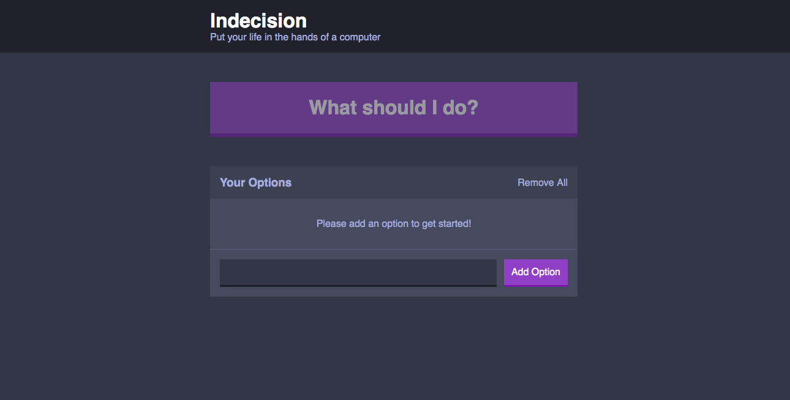
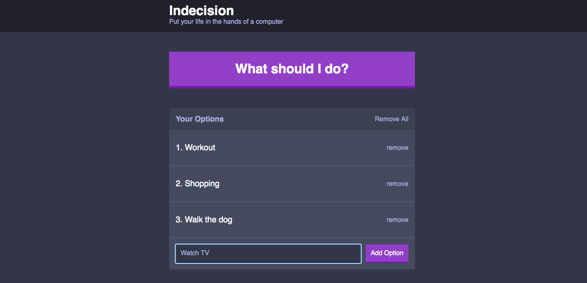
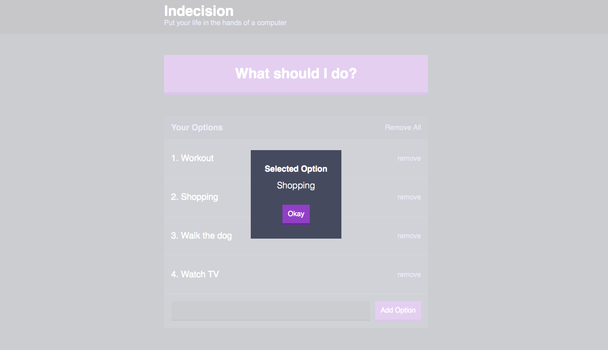
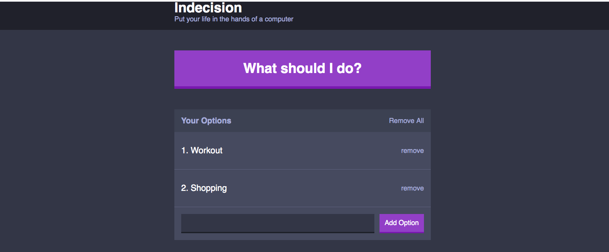

# Indecision-App

## Application description:

 I built a React based application that allows the user to post options they want to complete  and then randomly choose one of the options. After writing  down  and adding an option in the input box, the user will then click the "What should I do" button which will randomly select the option for them. Users can also remove options one at a time or all at once.
 

 ## Click [here](https://indescision.herokuapp.com/) for the live app. 
 
 This is the home screen:
 
 
 
 The user will  add options by typing in the input box"
 

  
  The user will then click the "What should I do?" button and then a modal will pop on the screen displaying a random  selected option:
  
  
   
  
  
   The user can  remove options by clicking remove or the user can remove all options as once by clicking remove all:
   
 
    
  
  
## Libraries and Frameworks:

- React
- React-Dom
- React-Model
- Node-Sass
- React-Modal
- React-Scripts
- Normalize.css

## Email:

bml201095@gmail.com  
